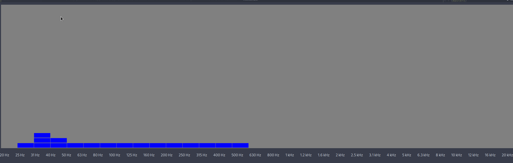
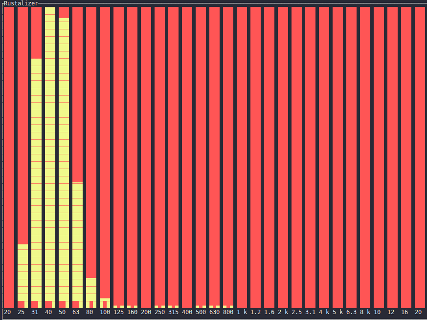

# Rustalizer

A simple audio frequency visualizer made with Rust. 

Currently it uses GTK for displaying GUI, and cpal for audio interfacing, thus being cross-platform.
The TUI version utilizes `tui-rs` and `crossterm` for terminal backend.

## Installation

`$ git clone https://github.com/JDuchniewicz/Rustalizer/`  
`$ cd Rustalizer`  
`$ cargo install --path .`  
After installation, if PATH contains `cargo/bin` folder, can be called from command-line with `$ rustalizer <opts>`  

## User guide
Run the application without installation:  
`cargo run -- --help`

or with:  
`rustalizer --help`

## Roadmap

- [ ] Console-only rendering
- [ ] Equalizer pass-through
- [ ] Multiple-channel support
- [ ] Visualization customization (colors / shapes)

## License

This project is licensed under the MIT License - see the [LICENSE](LICENSE) file for details
